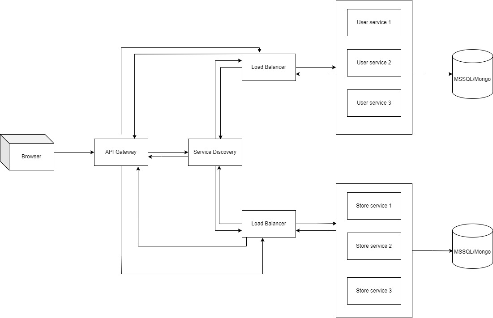

# Project: Online Gadget Store (phones, tablets, PCs)

A platform that allows users to buy, try see info about products online. Users can buy things without going outside for example Iphones or Samsungs. Developing an application with a microservices architecture entails decomposing the app's different components and functionalities into distinct, autonomous services.

The relevance and necessity of microservices for such an application stem from the following key concepts:

* **Flexibility**: Microservices provide the flexibility to select the optimal technology stack for each service, which is crucial because various components of the application may demand different technologies or databases.

* **Error in system**: In the event that a single service within the application experiences a failure or encounters issues, it doesn't necessarily result in a complete system outage. Users can continue to access other aspects of the application, like watching price products, while the problematic service is being addressed and restored to normal operation.

* **Scalability** The application may encounter fluctuations in user activity levels, and microservices enable the ability to scale specific components independently. For example, the user registration/authentication service can be expanded separately from the store service to efficiently manage sudden surges in user activity.

* **Sustainability** If app will grow, with time will be much easier to sustain those microservices in comparison with monolith system. Even with this we can extend only one microservice and system will work properly.

* **Freedom of developing** Developers can update specific components of the application independently, such as adding features to user authentication or adding to cart, delete or so on.


Nowadays, almost every big company has implemented microservices into their apps, systems etc. For example:

1.) Amazon: Amazon uses microservices in its e-commerce platform. Each service manages a specific aspect of the shopping experience, such as product search, recommendation algorithms, inventory management, and order processing. This approach contributes to Amazon's ability to handle high traffic loads and continuously innovate.

2.) Twitter: Twitter employs microservices to power its social media platform. Services handle tasks like tweet delivery, user timelines, notifications, and analytics. This architecture allows Twitter to provide a real-time experience to millions of users worldwide.

3.) LinkedIn: LinkedIn, the professional networking platform, relies on microservices for its various functionalities. Services handle user profiles, job recommendations, messaging, and content delivery. This architecture helps LinkedIn maintain a responsive and scalable platform for professionals.


## **Service Boundaries:**

1. API Gateway - is used for routing client requests

2. Load Balancer - is used to make equaly distributed data on all resources in order to work faster requests

3. Service Discovery - is used for dynamic service registration and discovery

4. User Service - is used for working with user interactions (logging, buying stuff etc.)

5. Store Service - is used for working with store operations data

6. Database - To serve as the central repository for critical application data in a microservices architecture(database) this service is responsible for storing, managing, and providing access to critical application data. 



**Technology Stack:** JS, Python, gRPC, REST API, DB

**Deployment and Scaling** : Docker


## Endpoints

### Register User
POST request with the purpose of user registration. It sends a JSON payload containing a username and password for a user account creation.
#### Method: POST
>```
>http://localhost:9000/users/register

>```
#### Headers

|Content-Type|Value|
|---|---|
|Content-Type|application/json|
|Accept|application/json|

#### Body

```json
{
   "username": "example_user",
  "password": "secure_password123"
}
```

#### Response

```json
{
    "message":"Successfully created"
}
```

#### Authentication: no auth

### Login User
A POST request tailored for user authentication is used to transmit a JSON payload to the server, containing a username and password, with the intention of logging in.
#### Method: POST
>```
>http://localhost:9000/users/login
>```
#### Headers

|Content-Type|Value|
|---|---|
|Content-Type|application/json|
|Accept|application/json|

#### Body

```json
{
   "username": "example_user",
   "password": "secure_password123"
}
```

#### Response

```json
{
    "access-token":"{{accessToken}}"
}
```

### Delete User
DELETE request intended to delete a user account, including authentication using a bearer token in the "Authorization" header, and the request body provides the user's password as a security measure to confirm the user's identity.
#### Method: DELETE
>```
>http://localhost:9000/users/delete/user1
>```
#### Headers

|Content-Type|Value|
|---|---|
|Content-Type|application/json|
|Accept|application/json|

#### Body

```json
{
    "password":"passwrod2232"
}
```

#### Response

```json
{
    "message":"Successfully deleted"
}
```

### Add item in  Shopping Cart
POST request to create a shopping cart  for a specific user where he can add some items. It recieves all items which are available, adds them into cart and sends request to db to purchase all products in json format
#### Method: POST
>```
>http://localhost:8000/purchase
>```
#### Headers

|Content-Type|Value|
|---|---|
|Content-Type|application/json|
|Accept|application/json|

#### Body

```json
{
    "username":"test0",
    "products": [
        {"id": 1,
        "name" : "test",
        "category" : 2,
        "price" : 34},
        {"id": 2,
        "name" : "test1",
        "category" : 4,
        "price" : 12}
        ]
}
```

#### Response

```json
{
    "message":"Successfully purchased"
}
```

#### Authentication: bearer token

### Get User's history of purchased items
GET request to retrieve a user's history items purchased.
#### Method: GET
>```
>http://localhost:9000/users/tim1/history
>```
#### Headers

|Content-Type|Value|
|---|---|
|Accept|application/json|

#### Response 

```json
{
    "username": "tim",
    "data" : [
        {"date": "21:13:2023",
        "purchase_id": 1,
        "products_id": [2, 4, 6],
        "price" : 34},
        {"date": "21:13:2023",
        "purchase_id": 1,
        "products_id": [2, 4, 6],
        "price" : 34
    ]
}
```

### Get User's Shopping History
GET request to retrieve a user's specific purchase.
#### Method: GET
>```
>http://localhost:9000/users/tim1/history/34342
>```
#### Headers

|Content-Type|Value|
|---|---|
|Accept|application/json|

#### Response

```json

{"date": "21:13:2023",
    "purchase_id": 1,
    "products_id": [2, 4, 6],
    "price" : 34}

```

### Delete purchase history
DELETE request intended to delete a user's shopping history for a specified user
#### Method: DELETE
>```
>http://localhost:9000/users/tim1/history/34342
>```
#### Headers

|Content-Type|Value|
|---|---|
|Content-Type|application/json|
|Accept|application/json|


#### Response

```json
{
    "message":"History purchase successfully deleted"
}
```